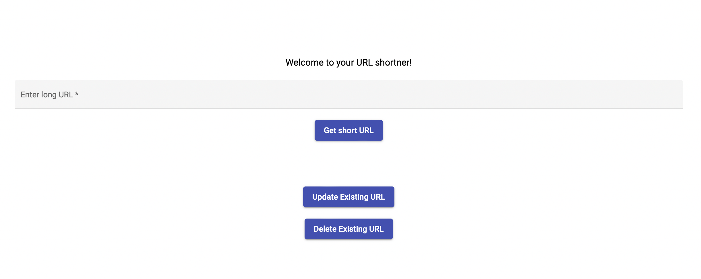
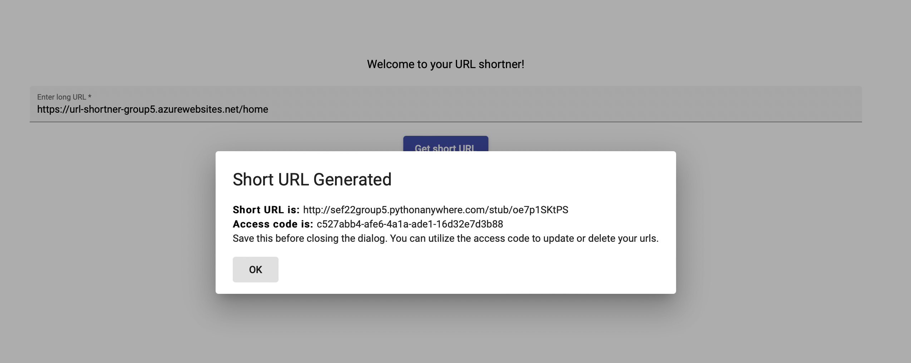
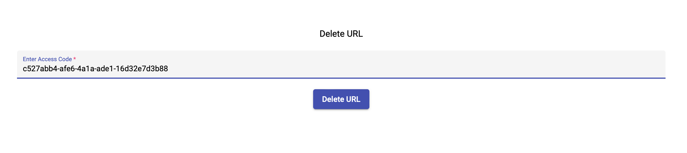

# URL-Shortner 🔗

## URL-Shortner - Simple URL shortener

Wondering why the Shortner is misspelled? Thats because this project is all about making it short, simple and easy to share.
URL-Shortner aims to be the easiest ad-free url shortener that can be used to quickly generate sharable short urls.

- Ever typed out a long url on your phone only to see that you missed a '/' or misspelled a word?

- Have you shared multiple URLs with others because you sent an incorrect URL earlier?

- Had to update the same document every year but with updated URL, wondering if there was a way to keep the URL the same and just redirect to new one every year?

If you answered yes to any of the above questions, then this is going to bring a smile to your face!
The URL-Shortner is a simple tool that you can utilize to create short versions of that long urls and share it with others. Additionally, its just a few clicks to update an existing URL if you made a mistake or the URL has changes over time. If you don't need it anymore, simply go ahead and delete that.

URL-Shortner has APIs developed using python and front-end web application developed using angular.

## How to use?

### Generate

Go to [yoururl.tech/url-shortner](https://yoururl.tech/url-shortner)

Enter the long version of the URL you want to generate a short version and click **Get short URL**.
You should see a popup mentioning the short version of URL and an **access code**. This code can be utilized to update or delete an existing URL.

> Save the access code, since you won't be able to access it later.

### Update

Click on Update Existing URL button. This will take you to the update url page.

Enter the following details:

1. **Short URL stub:** This is the last part of the short version of url. Eg: For the URL http://sef22group5.pythonanywhere.com/stub/oe7p1SKtPS, `oe7p1SKtPS` is the stub.

2. **Access Code:**  This is the code that was provided to you at the time of creating new short URL.

3. **Updated long URL:**: Enter the updated URL for the existing short version of URL.

Click on Update URL and if all fields are correct and validated, the URL should be updated.

### Delete

If you no longer need a URL, click on Delete Existing URL button on the home page.

Enter the access code that was provided to you at the time of creating new short URL. Click on Delete URL, and if the access code is correct, it will successfully delete the URL.

---

## We love our contributors ❤️❤️

Make a [pull request](https://github.com/CSC510-Group-5/URL-Shortner/compare) to help contribute.

